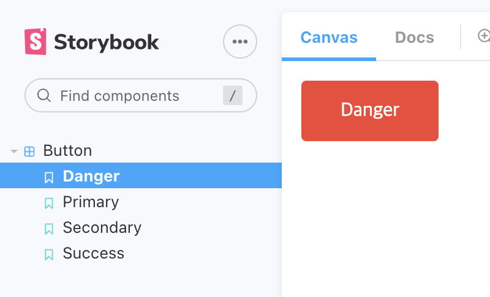

# StoryBook

## init

```
yarn create react-app sb-example

yarn add @storybook/cli --dev // yarn의 경우 이슈가 있어서 추가설치후 init

yarn sb init

yarn storybook // 스토리북 서버 실행
```

## Stories

```jsx
import React from "react";
import "./Button.css";

const Button = (props) => {
	const { variant = "primary", children, ...rest } = props;
	return (
		<div className={`button ${variant}`} {...rest}>
			{children}
		</div>
	);
};

export default Button;
```

기본 컴포넌트를 만들어 props로 스타일을 변형될 수 있게 작성할 때 스토리북은 프리뷰를 제공해준다.

stories라는 키워드가 붙은 파일들을 스토리북 서버에 반영한다.

```js
// Button.stories.js
export default {
	title: "Button", // 패널 이름
	component: Button, // 참조할 컴포넌트
};

// 각자 다른 스타일의 스토리들을 적어둔다.
export const Primary = () => <Button variant='primary'>Primary</Button>;
export const Secondary = () => <Button variant='secondary'>Secondary</Button>;
export const Success = () => <Button variant='success'>Success</Button>;
export const Danger = () => <Button variant='danger'>Danger</Button>;
```



## Story within Story

기존 스토리들을 import해서 재사용 가능

```js
import React from "react";
import { Primary } from "../Button/Button.stories";
import { Large } from "../Input/Input.stories";

export default {
	title: "form/Subscription",
};

export const PrimarySubscription = () => (
	<>
		<Large />
		<Primary />
	</>
);
```
